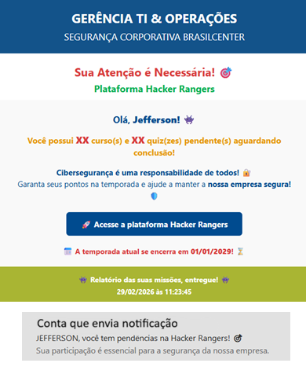
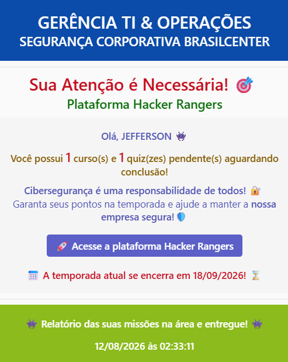

  
  
  
  

# Hacker Rangers - Notificações de Pendências via Power Automate

Repositório contendo os templates otimizados para automação de notificações de ações pendentes na plataforma Hacker Rangers, integrados via Microsoft Power Automate.

---

## 📦 Conteúdo do Repositório

- `email-template.html`: Template HTML responsivo, otimizado para a engine do Outlook Desktop/Mobile, com suporte a *preheader* dinâmico e botão compacto de CTA.
- `adaptive-card-teams.json`: Payload do Adaptive Card (v1.3) estruturado para envio de alertas visuais via bot do Microsoft Teams.

---

## ⚙️ Pré-requisitos & Mapeamento de APIs

Para alimentar as métricas do e-mail e do card adaptável no Power Automate, utilize as respostas dos seguintes endpoints relatórios da API do Hacker Rangers:

- **Cursos Pendentes:** Endpoint `/api/adm/report/tabular/30`
- **Quizzes Pendentes:** Endpoint `/api/adm/report/tabular/26`

> **Dica:** Utilize a ação *Filtrar Array (Filter Array)* no Power Automate após consumir os relatórios para calcular o saldo de pendências individual de cada usuário antes do envio.

---

## 🛠️ Como Utilizar no Power Automate

### E-mail HTML (Outlook)
1. No seu fluxo do Power Automate, adicione a ação **Enviar um e-mail (V2)**.
2. Alterne a exibição do corpo da mensagem para o modo **HTML** (`</>`).
3. Copie o conteúdo do arquivo `email-template.html` e cole no corpo do e-mail.

### Adaptive Card (Teams)
1. Adicione a ação **Postar card adaptável em um chat ou canal** no Teams.
2. Copie todo o conteúdo do arquivo `adaptive-card-teams.json` e cole no campo **Adaptive Card**.

---

## 📸 Pré-visualização

<table border="0" style="border: none;">
  <tr>
    <td align="center" width="50%" style="border: none;">
      <strong>E-mail (Outlook)</strong>  
      
    </td>
    <td align="center" width="50%" style="border: none;">
      <strong>Adaptive Card (Teams)</strong>  
      
    </td>
  </tr>
</table>

---

## 👤 Autor

Desenvolvido por **Jefferson Lima**  

Projeto construído para otimizar o engajamento das campanhas de conscientização em cibersegurança e cultura de segurança corporativa.

